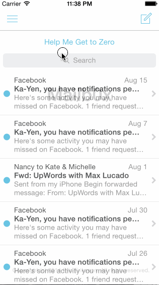

# Mailb0x - iOS Bootcamp for Designers, Assignment 3

Exploring animations & gesture recognizers with a mock Mailbox application. 

Time spent: 6 hours spent in total

Notes: Couldn't get the color change to work in time, also had some trouble with the EdgePanGestureRecognizer, so elected to use a button to hide the menu. 

Completed user stories:

* [x] User can scroll the list of messages
* [x] On dragging the message left... As the reschedule icon is revealed, it should start semi-transparent and become fully opaque. If released at this point, the message should return to its initial position.
* [x] After 60 pts, the later icon should start moving with the translation and the background should change to yellow.
* [x] Upon release, the message should continue to reveal the yellow background. When the animation it complete, it should show the reschedule options.
* [x] User can tap to dismissing the reschedule or list options. After the reschedule or list options are dismissed, you should see the message finish the hide animation.
* [x] On dragging the message right... As the archive icon is revealed, it should start semi-transparent and become fully opaque. If released at this point, the message should return to its initial position.
* [x] After 60 pts, the archive icon should start moving with the translation and the background should change to green.
* [x] Upon release, the message should continue to reveal the green (yellow in my case) background. When the animation it complete, it should hide the message.

* [x] Optional: Panning from the edge should reveal the menu
* [x] Optional: If the menu is being revealed when the user lifts their finger, it should continue revealing.

Walkthrough of all user stories:

GIF created with [LiceCap](http://www.cockos.com/licecap/).

